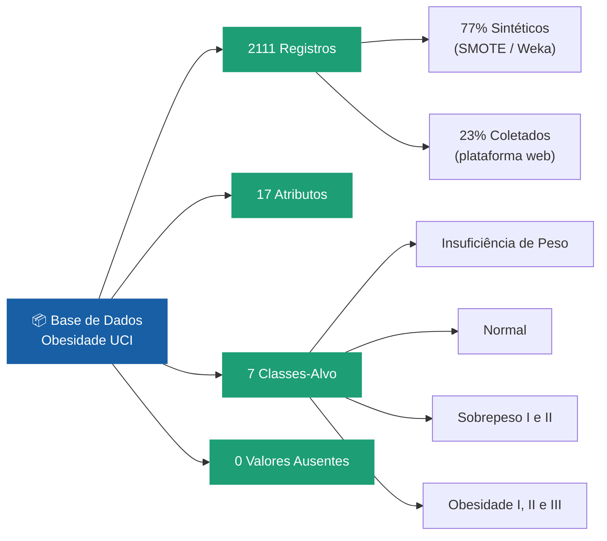
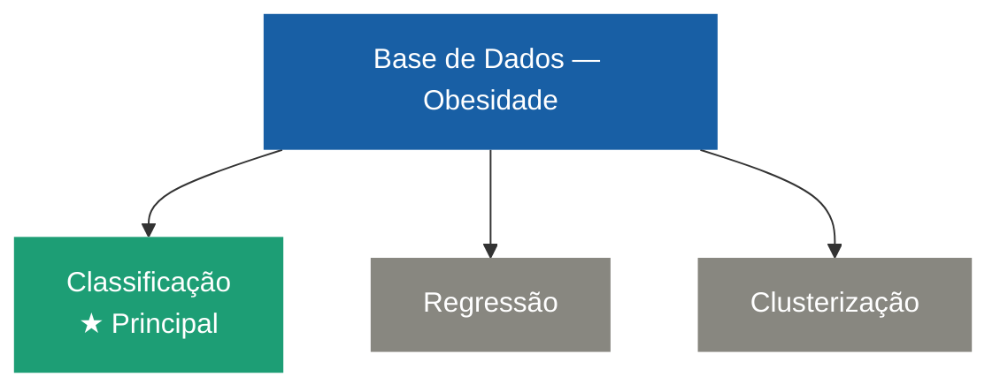
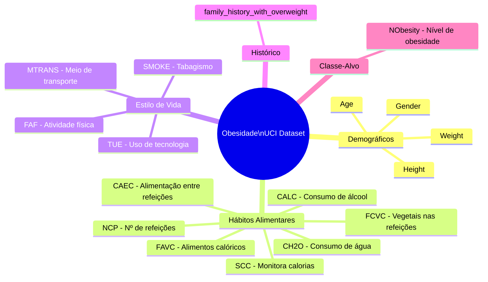
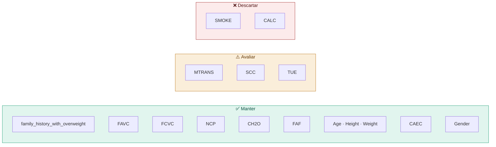

# Documentação da Base de Dados
## Estimation of Obesity Levels Based On Eating Habits and Physical Condition

---

## Visão Geral

| Campo | Informação |
|---|---|
| **Fonte** | UC Irvine Machine Learning Repository |
| **URL** | https://archive.ics.uci.edu/dataset/544/estimation+of+obesity+levels+based+on+eating+habits+and+physical+condition |
| **DOI** | 10.24432/C5H31Z |
| **Doado em** | 26/08/2019 |
| **Autores** | Fabio Mendoza Palechor, Alexis De la Hoz Manotas |
| **Publicado em** | Data in Brief (2019) |
| **Licença** | Creative Commons Attribution 4.0 International (CC BY 4.0) |
| **Países de origem** | México, Peru e Colômbia |
| **Área** | Saúde e Medicina |

---

## Características Gerais



---

## Tarefas Suportadas



> Para este projeto utilizaremos **Classificação multiclasse** — prever a categoria de IMC de um indivíduo com base em seus hábitos e características físicas.

---

## Atributos Completos

### Variável-Alvo

| Atributo | Tipo | Descrição | Valores Possíveis |
|---|---|---|---|
| `NObesity` | Categórico | Nível de obesidade (classe) | Insufficient Weight · Normal Weight · Overweight Level I · Overweight Level II · Obesity Type I · Obesity Type II · Obesity Type III |

---

### Atributos Demográficos

| Atributo | Tipo | Descrição | Valores |
|---|---|---|---|
| `Gender` | Categórico | Gênero do indivíduo | Male / Female |
| `Age` | Contínuo | Idade em anos | 14 – 61 |
| `Height` | Contínuo | Altura em metros | — |
| `Weight` | Contínuo | Peso em quilogramas | — |

---

### Hábitos Alimentares

| Atributo | Sigla | Tipo | Descrição | Valores |
|---|---|---|---|---|
| Histórico familiar com sobrepeso | `family_history_with_overweight` | Binário | Algum familiar sofre ou sofreu de sobrepeso? | yes / no |
| Consumo frequente de alimentos calóricos | `FAVC` | Binário | Você come alimentos calóricos com frequência? | yes / no |
| Consumo de vegetais nas refeições | `FCVC` | Inteiro | Você costuma comer vegetais nas refeições? | 1 · 2 · 3 |
| Número de refeições principais | `NCP` | Contínuo | Quantas refeições principais você faz por dia? | 1 · 2 · 3 · 4 |
| Consumo de alimentos entre refeições | `CAEC` | Categórico | Você come algum alimento entre as refeições? | no · Sometimes · Frequently · Always |
| Consumo diário de água | `CH2O` | Contínuo | Quantos litros de água você bebe por dia? | 1 · 2 · 3 |
| Consumo de álcool | `CALC` | Categórico | Com que frequência você consome álcool? | no · Sometimes · Frequently · Always |
| Monitoramento de calorias | `SCC` | Binário | Você monitora as calorias que consome diariamente? | yes / no |

---

### Condição Física e Estilo de Vida

| Atributo | Sigla | Tipo | Descrição | Valores |
|---|---|---|---|---|
| Tabagismo | `SMOKE` | Binário | Você fuma? | yes / no |
| Frequência de atividade física | `FAF` | Contínuo | Com que frequência você pratica atividade física? (dias/semana) | 0 · 1 · 2 · 3 |
| Tempo de uso de dispositivos tecnológicos | `TUE` | Inteiro | Quanto tempo você usa dispositivos tecnológicos por dia? (horas) | 0 · 1 · 2 |
| Meio de transporte mais utilizado | `MTRANS` | Categórico | Qual meio de transporte você usa com mais frequência? | Automobile · Motorbike · Bike · Public Transportation · Walking |

---

## Diagrama de Atributos por Categoria



---

## Classes-Alvo e Faixas de IMC

| Classe | IMC (kg/m²) | Descrição |
|---|---|---|
| Insufficient Weight | < 18,5 | Abaixo do peso ideal |
| Normal Weight | 18,5 – 24,9 | Peso dentro do esperado |
| Overweight Level I | 25,0 – 27,4 | Sobrepeso leve |
| Overweight Level II | 27,5 – 29,9 | Sobrepeso moderado |
| Obesity Type I | 30,0 – 34,9 | Obesidade grau I |
| Obesity Type II | 35,0 – 39,9 | Obesidade grau II |
| Obesity Type III | ≥ 40,0 | Obesidade grau III (mórbida) |

---

## Decisões do Grupo — Atributos



---

## Como Importar em Python

```python
from ucimlrepo import fetch_ucirepo

dataset = fetch_ucirepo(id=544)

X = dataset.data.features   # atributos (16 colunas)
y = dataset.data.targets    # variável-alvo: NObesity

print(dataset.metadata)
print(dataset.variables)
```

> Instale com: `pip install ucimlrepo`

---

## Arquivo da Base

| Arquivo | Tamanho |
|---|---|
| `ObesityDataSet_raw_and_data_sinthetic.csv` | 257,5 KB |

---

## Referência Bibliográfica

```
Palechor, F. M., & Manotas, A. D. (2019).
Dataset for estimation of obesity levels based on eating habits and physical condition
in individuals from Colombia, Peru and Mexico.
Data in Brief, 25, 104344.
https://doi.org/10.1016/j.dib.2019.104344
```

```
Estimation of Obesity Levels Based On Eating Habits and Physical Condition [Dataset]. (2019).
UCI Machine Learning Repository.
https://doi.org/10.24432/C5H31Z
```

---

*Documentação elaborada pelo Grupo 5 — Ciência de Dados · Dom Helder Centro Universitário · 2026*