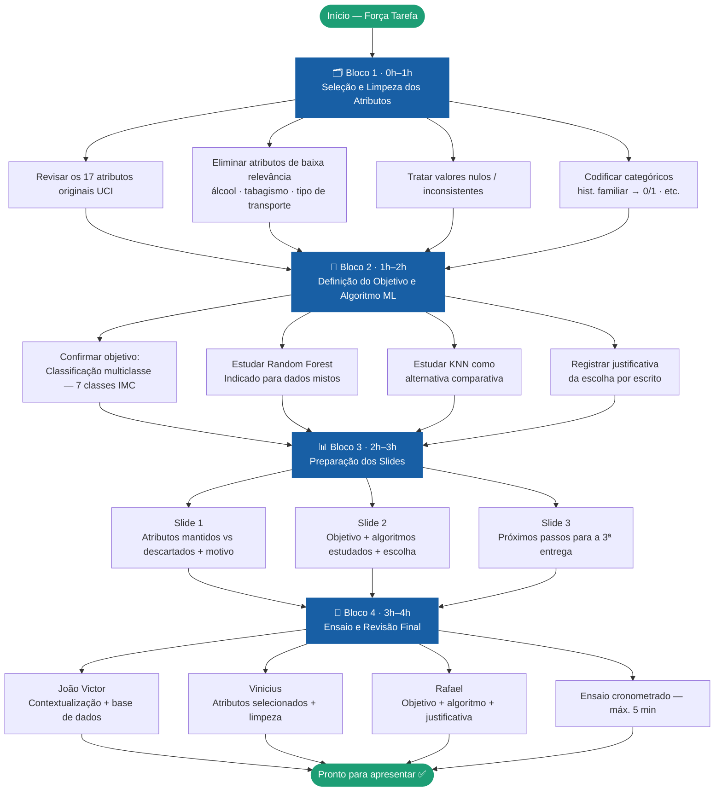
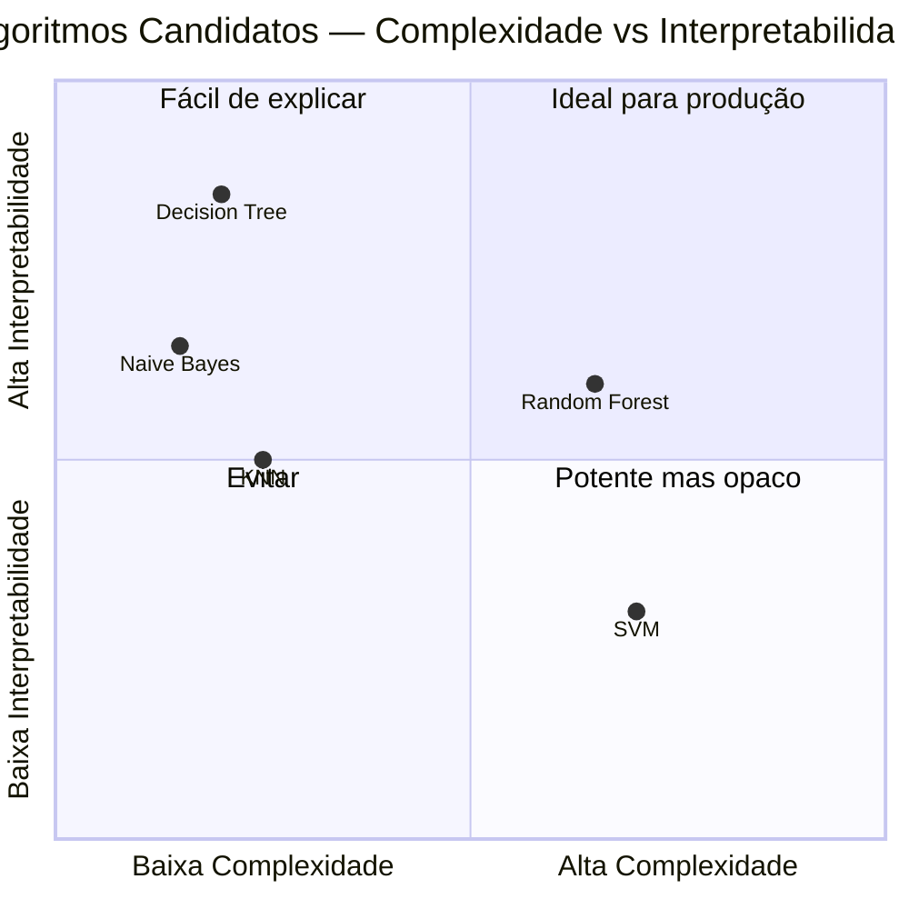

# Planejamento — Segunda Apresentação de Ciência de Dados
**Tema:** Obesidade — Causas, Prevalência e Fatores de Risco  
**Grupo:** João Victor Fernandes Lima · Vinicius Barros Marinho · Rafael de Andrade Alves  
**Entrega:** 04/05 | Apresentação: 30/04 | Duração máxima: 5 minutos

---

## Visão Geral dos Blocos (4 horas)

```mermaid
gantt
    title Plano de Trabalho — 4 Horas
    dateFormat HH:mm
    axisFormat %Hh

    section Bloco 1
    Seleção e limpeza dos atributos       :crit, b1, 00:00, 1h

    section Bloco 2
    Definição do objetivo e algoritmo ML  :crit, b2, 01:00, 1h

    section Bloco 3
    Preparação dos slides                 :b3, 02:00, 1h

    section Bloco 4
    Ensaio e revisão final                :b4, 03:00, 1h
```

---

## Fluxo de Atividades

---

## Checklist por Bloco

### Bloco 1 — Seleção e Limpeza dos Atributos
- [ ] Revisar os 17 atributos originais da base UCI
- [ ] Eliminar atributos com baixa relevância (álcool, tabagismo, tipo de transporte)
- [ ] Verificar valores nulos ou fora do intervalo esperado
- [ ] Codificar variáveis categóricas (ex: histórico familiar → 0/1)

### Bloco 2 — Definição do Objetivo e Algoritmo ML
- [ ] Confirmar tipo: Classificação multiclasse (7 categorias de IMC)
- [ ] Estudar Random Forest (indicado para dados mistos)
- [ ] Estudar KNN como alternativa comparativa
- [ ] Registrar justificativa da escolha final por escrito

### Bloco 3 — Preparação dos Slides
- [ ] Slide com tabela: atributos mantidos vs descartados + motivo
- [ ] Slide com fluxo do modelo (entrada → algoritmo → classe predita)
- [ ] Slide com próximos passos para a 3ª entrega
- [ ] Revisar formatação para manter padrão visual da 1ª apresentação

### Bloco 4 — Ensaio e Revisão Final
- [ ] João Victor: contextualização + base de dados
- [ ] Vinicius: atributos selecionados e limpeza
- [ ] Rafael: objetivo + algoritmo escolhido + justificativa
- [ ] Ensaio cronometrado: máx. 5 minutos

---

## Atributos Recomendados

| Atributo | Tipo | Relevância | Decisão |
|---|---|---|---|
| Histórico familiar de obesidade | Categórico | Alta | ✅ Manter |
| Hábitos alimentares (FAVC) | Categórico | Alta | ✅ Manter |
| Frequência de atividade física | Numérico | Alta | ✅ Manter |
| Consumo diário de água | Numérico | Alta | ✅ Manter |
| Número de refeições principais | Numérico | Alta | ✅ Manter |
| Idade / Peso / Altura | Numérico | Média | ✅ Manter |
| Tipo de transporte utilizado | Categórico | Baixa | ⚠️ Avaliar |
| Consumo de álcool | Categórico | Baixa | ❌ Descartar |
| Tabagismo | Categórico | Baixa | ❌ Descartar |

---

## Algoritmos Candidatos

**Recomendação:** Random Forest — robusto a overfitting, lida bem com dados mistos numéricos e categóricos, e performa bem em classificação multiclasse.

---

*Gerado em 25/04/2026 · Ciência de Dados — Dom Helder Centro Universitário*