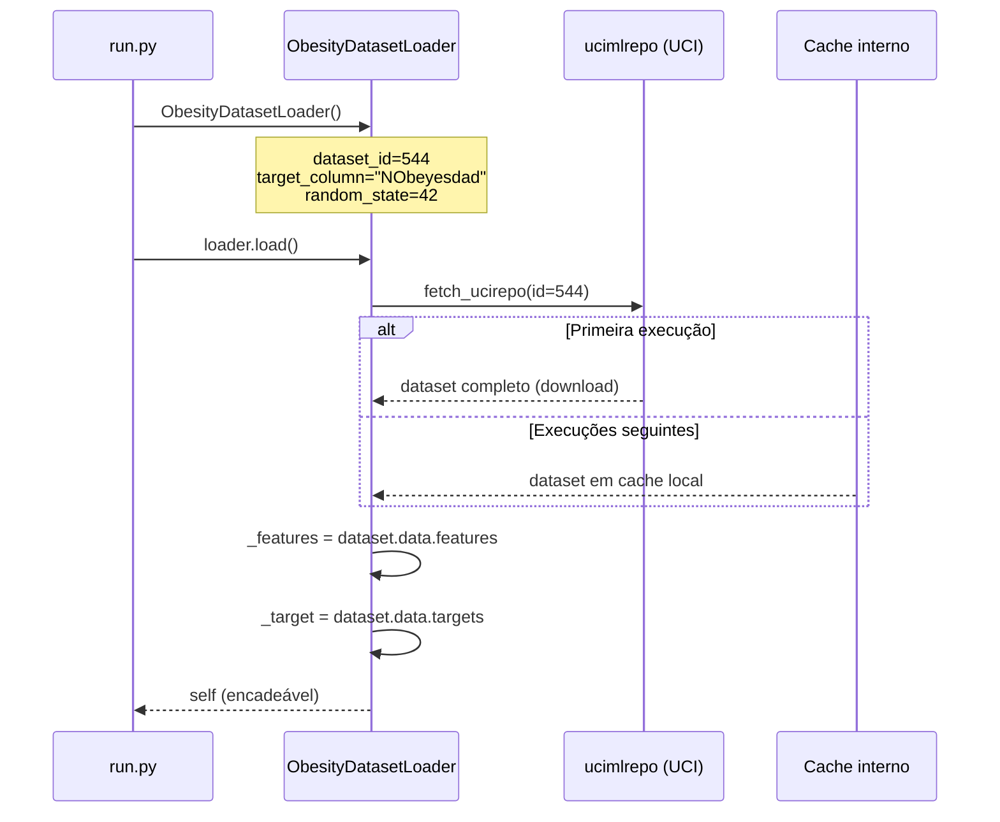
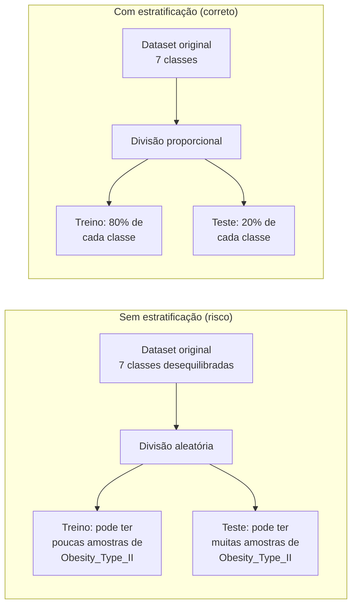

# 01 — Dataset e Carregamento de Dados

## O dataset

O projeto usa o **UCI Obesity Levels Dataset** (id=544), disponível publicamente no UCI Machine Learning Repository.

| Propriedade | Valor |
|-------------|-------|
| Total de amostras | 2.111 |
| Features de entrada | 16 |
| Variável alvo | `NObeyesdad` (7 classes) |
| Valores ausentes | 0 |
| Origem | México, Peru, Colômbia |
| Composição | 77% sintético (SMOTE) + 23% coletado via web |

### As 7 classes alvo


As classes seguem uma escala contínua de IMC — classes vizinhas são naturalmente mais difíceis de separar, o que explica as principais confusões que o modelo comete.

### As 16 features de entrada

| Tipo | Features |
|------|----------|
| Demográfico | `Gender`, `Age`, `Height`, `Weight` |
| Hábitos alimentares | `FAVC`, `FCVC`, `NCP`, `CAEC`, `CH2O`, `CALC`, `SCC` |
| Histórico | `family_history_with_overweight` |
| Estilo de vida | `SMOKE`, `FAF`, `TUE`, `MTRANS` |

---

## A classe `ObesityDatasetLoader`

Definida em `src/obesity_project/data/dataset_loader.py`, é uma **dataclass** que centraliza todo o acesso ao dataset. O módulo Decision Tree não acessa o dataset diretamente — ele sempre passa por esse loader.

### Por que uma classe separada?

Separar o carregamento do modelo permite que múltiplos experimentos (Decision Tree, Random Forest, futuros) compartilhem o mesmo dataset carregado com a mesma lógica, sem duplicar código.

### Fluxo de carregamento



### Código da classe

```python
@dataclass
class ObesityDatasetLoader:
    dataset_id: int = 544
    target_column: str = "NObeyesdad"
    random_state: int = 42
    _dataset: Any | None = field(default=None, init=False, repr=False)
    _features: pd.DataFrame | None = field(default=None, init=False, repr=False)
    _target: pd.DataFrame | None = field(default=None, init=False, repr=False)
```

Os atributos prefixados com `_` não aparecem no `repr` e não são passados no construtor (`init=False`). Isso garante que o estado interno (dataset carregado) seja gerenciado apenas pelos métodos da classe.

### Guard `_ensure_loaded`

Todos os métodos de acesso chamam internamente `_ensure_loaded()` antes de retornar dados:

```python
def _ensure_loaded(self) -> None:
    if self._dataset is None or self._features is None or self._target is None:
        raise RuntimeError("Dataset not loaded. Call load() before accessing data.")
```

Isso impede bugs silenciosos: se alguém chamar `get_features()` sem ter chamado `load()` antes, recebe um erro claro.

---

## Split treino/teste estratificado

O loader expõe o método `train_test_split`, que usa internamente o `train_test_split` do sklearn com `stratify`:

```python
def train_test_split(self, test_size=0.2, stratify=True):
    stratify_values = self._target[self.target_column] if stratify else None
    return sklearn_train_test_split(
        self._features,
        self._target,
        test_size=test_size,
        random_state=self.random_state,
        stratify=stratify_values,
    )
```

### Por que estratificar?



**Com `stratify=True`**, o sklearn garante que cada classe aparece no treino e no teste na mesma proporção do dataset original. Isso é fundamental para que as métricas de avaliação sejam confiáveis — especialmente em datasets onde as classes não são perfeitamente balanceadas.

### Resultado do split

| Conjunto | Amostras | Proporção |
|----------|----------|-----------|
| Treino | 1.688 | 80% |
| Teste | 423 | 20% |
| Total | 2.111 | 100% |

O `random_state=42` garante que qualquer execução do código produza exatamente o mesmo split — essencial para reprodutibilidade científica.
