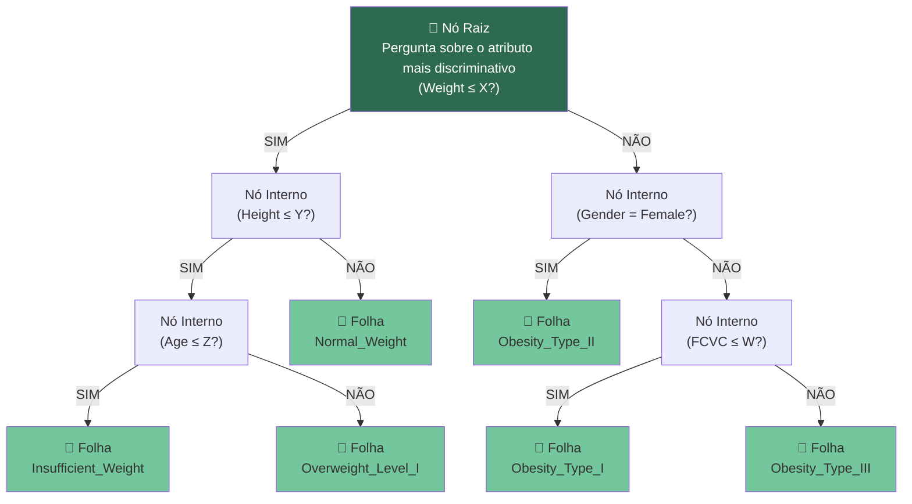
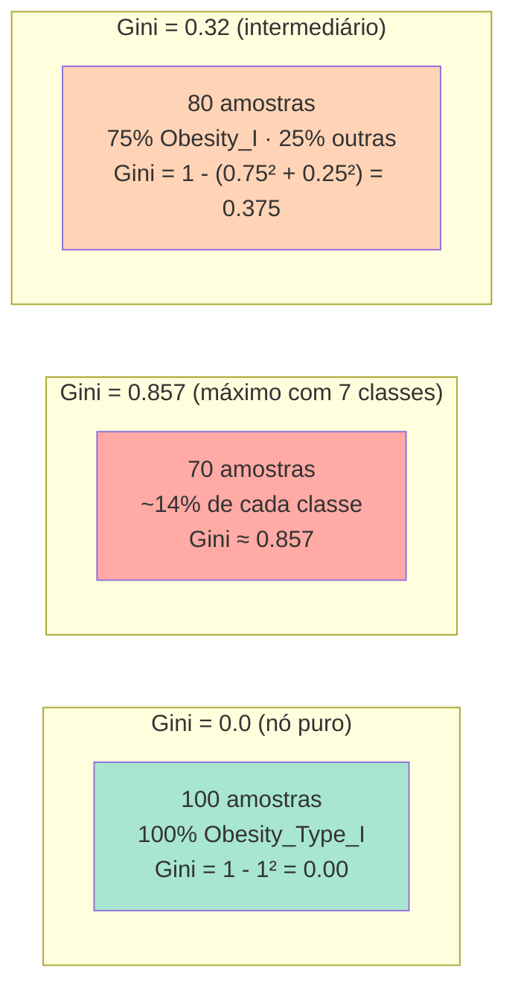
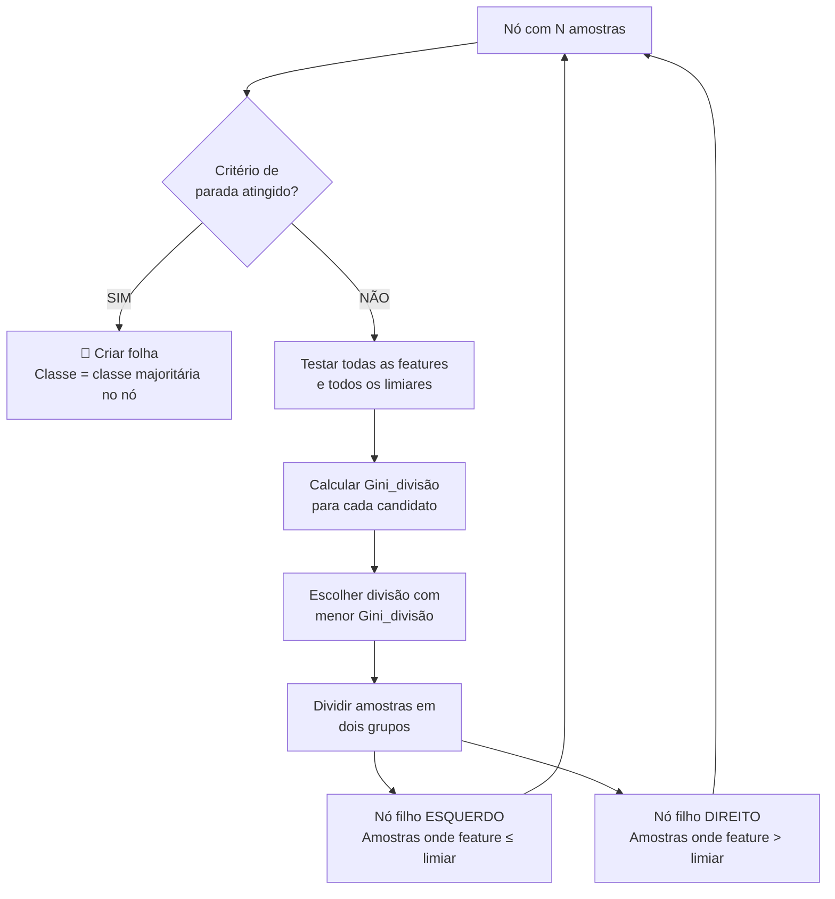
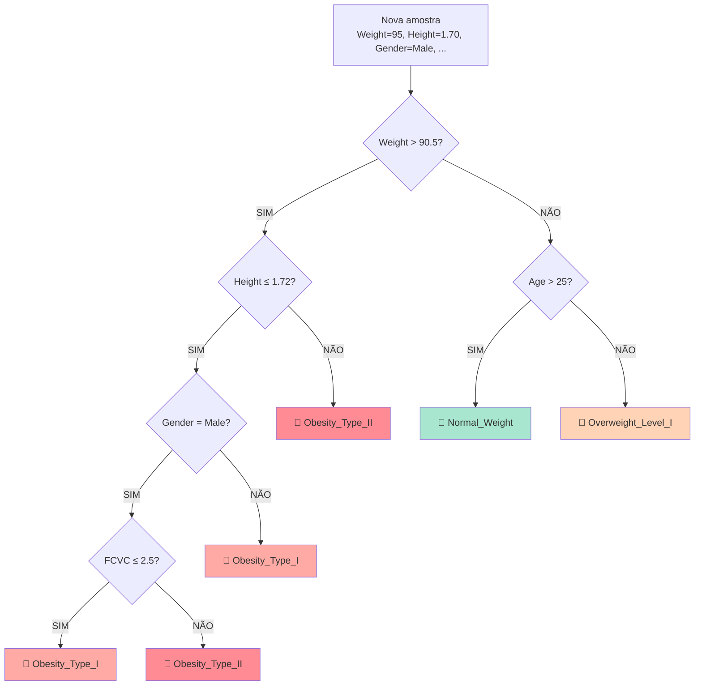
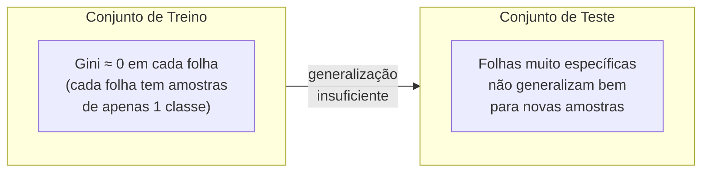

# 02 — Como a Árvore de Decisão Funciona Internamente

## O problema a resolver

Dado um paciente com 16 atributos (peso, altura, hábitos alimentares, etc.), classificá-lo em uma de 7 categorias de obesidade.

A árvore resolve isso fazendo perguntas binárias encadeadas sobre os atributos até chegar a uma conclusão.

---

## Estrutura da árvore



- **Nó raiz:** a primeira divisão, sobre o atributo com maior poder discriminativo
- **Nós internos:** perguntas intermediárias que refinam a classificação
- **Folhas:** nós terminais que contêm a classe prevista
- **Profundidade real desta implementação:** 11 níveis
- **Número de folhas:** 105

---

## O critério Gini — como a árvore escolhe onde dividir

A cada nó, o algoritmo precisa escolher: *qual feature usar?* e *qual valor de corte usar?*

A resposta vem do **índice de Gini**, que mede a **impureza** de um nó — ou seja, quão misturadas estão as classes nele.

### Fórmula do Gini

```
Gini(nó) = 1 − Σ (pᵢ)²
```

Onde `pᵢ` é a proporção de amostras da classe `i` no nó.

### Exemplos concretos



O algoritmo quer **minimizar o Gini** após cada divisão. Ele testa todos os atributos e todos os possíveis limiares, e escolhe a combinação que produz os dois nós filhos mais puros.

### Impureza ponderada pós-divisão

```
Gini_divisão = (n_esq / n_total) × Gini(esq) + (n_dir / n_total) × Gini(dir)
```

O algoritmo escolhe a divisão com menor `Gini_divisão`.

---

## Processo de crescimento da árvore



### Critérios de parada (configuráveis)

| Parâmetro | Valor nesta impl. | Significado |
|-----------|:-----------------:|-------------|
| `max_depth` | `None` | Sem limite de profundidade |
| `min_samples_split` | `2` | Divide se tiver ≥ 2 amostras |
| `min_samples_leaf` | `1` | Folha com ≥ 1 amostra é aceita |

Com `max_depth=None` e `min_samples_split=2`, a árvore cresce até que cada folha contenha apenas amostras de uma única classe (Gini = 0), ou não haja mais divisões úteis. Isso explica por que a árvore atingiu profundidade 11 e 105 folhas.

---

## Como a previsão é feita (inferência)

Após o treinamento, classificar uma nova amostra é percorrer o caminho da raiz até uma folha:



A complexidade da inferência é **O(profundidade)** — no máximo 11 comparações por amostra. Isso torna a Árvore de Decisão extremamente rápida na fase de predição.

---

## Importância das features na Árvore de Decisão

A importância de uma feature é calculada com base na **redução total de Gini** que ela causa ao longo de toda a árvore:

```
Importância(feature) = Σ [impureza_pai − (n_esq/n_pai × impureza_esq) − (n_dir/n_pai × impureza_dir)]
                        para todos os nós onde essa feature foi usada
```

Ao final, os valores são normalizados para somar 1.0.

### Resultado nesta implementação

| Feature | Importância | Interpretação |
|---------|:-----------:|---------------|
| Weight | **47.41%** | Divide os grupos de IMC mais amplos logo no topo |
| Height | **21.63%** | Complementa o peso para calcular IMC indiretamente |
| Gender | **15.79%** | Usado como atalho após dividir por peso/altura |
| Age | 4.28% | Refinamento secundário |
| CALC, FAVC, FCVC | ~5% total | Ajustes nas fronteiras difíceis |
| SCC | **0.00%** | Nunca usado em nenhum nó |

A árvore concentrou **84.83%** do peso decisório nas 3 primeiras features. Isso acontece porque `Weight` e `Height` já separam muito bem as classes pelos extremos da escala de obesidade, e `Gender` funciona como desempate eficiente. As features de hábitos de vida ficam para ajustes finos nas fronteiras difíceis.

---

## Limitações da Árvore de Decisão isolada

### Overfitting

Sem restrição de profundidade, a árvore pode memorizar o conjunto de treino:



Isso explica parte da diferença de desempenho para o Random Forest: a árvore aprendeu padrões específicos do treino que não se repetem perfeitamente no teste.

### Alta variância

Uma pequena mudança no dataset de treino pode gerar uma árvore completamente diferente na raiz — porque o atributo escolhido no nó raiz muda, o que propaga alterações para toda a estrutura abaixo.

O Random Forest resolve exatamente esses dois problemas combinando 200 árvores com dados e features diferentes — cada uma imperfeita, mas o conjunto robusto.
