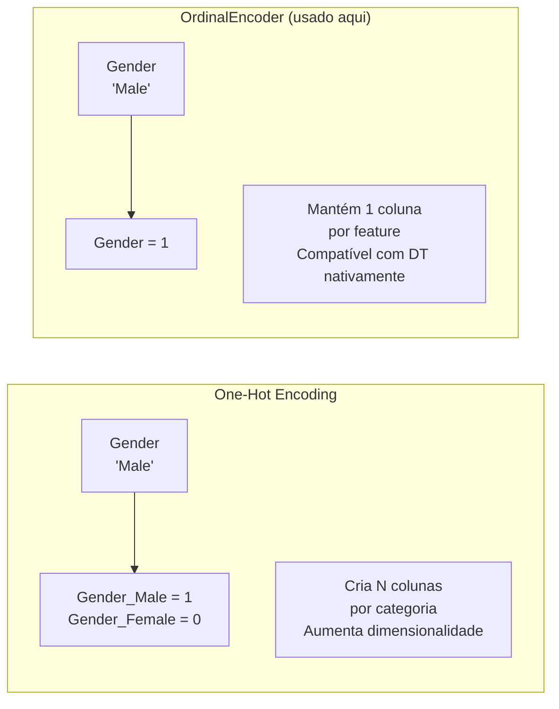
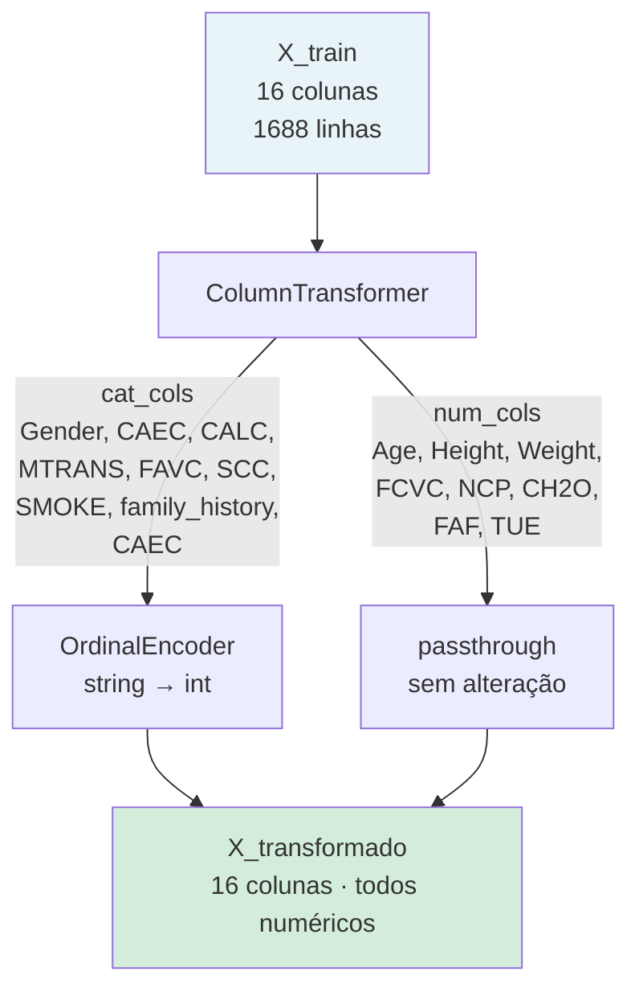
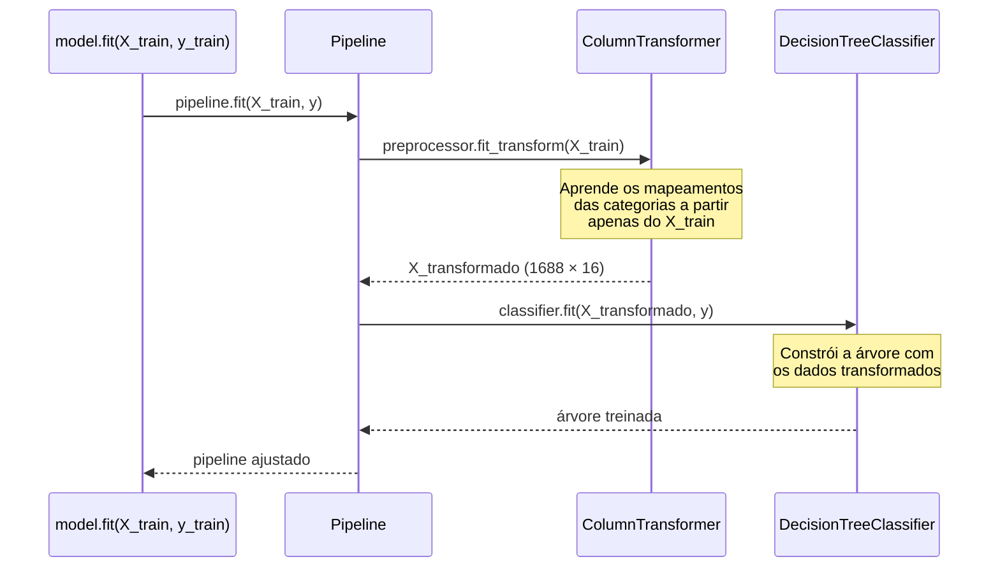
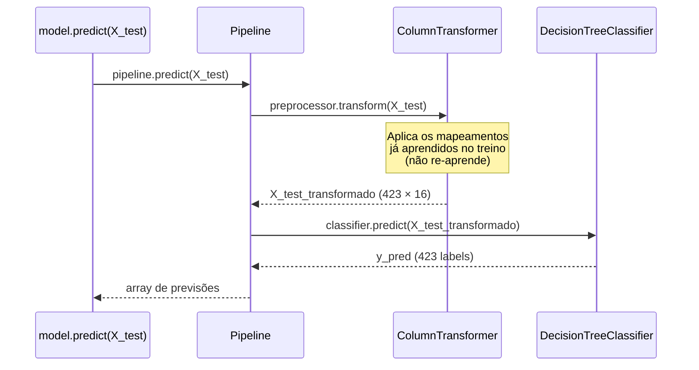
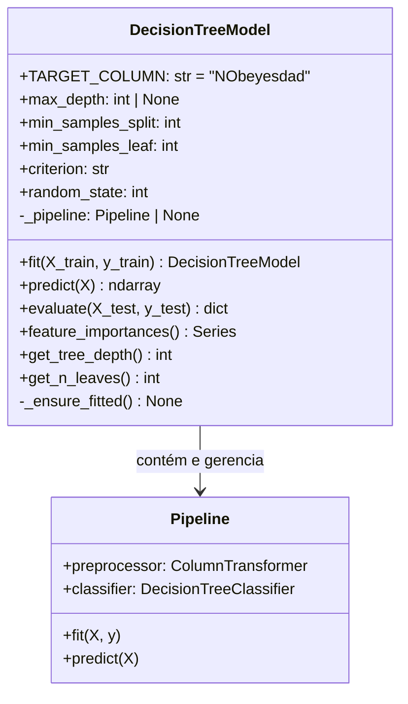
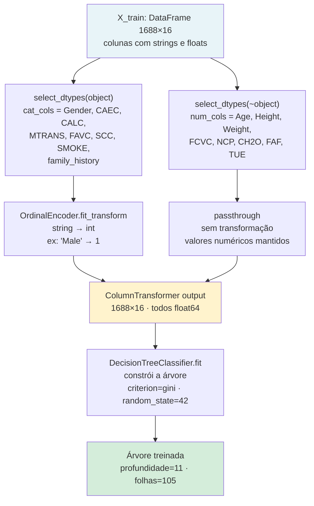

# 03 — Preprocessing, Pipeline e Classe `DecisionTreeModel`

## O problema com dados mistos

O dataset tem dois tipos de features que precisam de tratamento diferente antes de entrar no classificador:

| Tipo | Exemplos | Formato bruto | Problema |
|------|----------|---------------|---------|
| **Categórico** | Gender, CAEC, MTRANS, CALC | `"Male"`, `"Sometimes"`, `"Automobile"` | O algoritmo não opera com strings |
| **Numérico** | Age, Height, Weight, FCVC, NCP... | `25.4`, `1.72`, `80.0` | Pode ser usado diretamente |

A solução é um **pipeline de preprocessing** que transforma os dados antes de passá-los ao classificador.

---

## OrdinalEncoder — transformação de categóricas

O `OrdinalEncoder` mapeia cada valor único de uma coluna categórica para um inteiro:

```
Gender:  "Female" → 0,  "Male" → 1
CAEC:    "Always" → 0,  "Frequently" → 1,  "no" → 2,  "Sometimes" → 3
MTRANS:  "Automobile" → 0,  "Bike" → 1,  "Motorbike" → 2,  ...
```

### Por que OrdinalEncoder (e não One-Hot Encoding)?



Árvores de Decisão **não assumem ordem** entre os valores inteiros — elas testam limiares exatos como `Gender ≤ 0` (Female) ou `Gender > 0` (Male). Por isso o OrdinalEncoder é adequado e mais eficiente que o One-Hot Encoding neste contexto.

### Parâmetro `handle_unknown="use_encoded_value"` com `unknown_value=-1`

Se durante a inferência aparecer um valor nunca visto no treino (ex: uma nova categoria de transporte), o encoder atribui `-1` em vez de lançar erro. Isso torna o modelo robusto a dados inesperados.

---

## ColumnTransformer — tratamento seletivo por tipo

O `ColumnTransformer` aplica transformações diferentes a subconjuntos específicos das colunas:



O `remainder="drop"` garante que colunas não listadas em nenhum transformador sejam descartadas — embora neste caso todas as 16 colunas sejam cobertas.

### Como `fit` detecta as colunas automaticamente

```python
def fit(self, X_train: pd.DataFrame, y_train: pd.DataFrame) -> "DecisionTreeModel":
    cat_cols = X_train.select_dtypes(include="object").columns.tolist()
    num_cols = X_train.select_dtypes(exclude="object").columns.tolist()
```

Em vez de listar as colunas manualmente (hardcoded), o método inspeciona os **dtypes do DataFrame** em tempo de execução. Colunas de tipo `object` (string) vão para o OrdinalEncoder; todo o resto vai para passthrough. Isso torna o código robusto a mudanças no dataset.

---

## Pipeline sklearn — encadeamento sequencial

O `Pipeline` garante que preprocessing e classificação aconteçam sempre na ordem correta, sem vazamento de dados entre treino e teste:





**Ponto crítico:** o `ColumnTransformer` aprende os mapeamentos (`fit`) apenas com os dados de treino, e aplica (`transform`) esses mesmos mapeamentos no teste. Isso evita **data leakage** — o modelo nunca "vê" o conjunto de teste durante o treinamento.

---

## A classe `DecisionTreeModel` — visão completa



### Método `fit` — passo a passo

```python
def fit(self, X_train, y_train):
    # 1. Detecta colunas por dtype
    cat_cols = X_train.select_dtypes(include="object").columns.tolist()
    num_cols = X_train.select_dtypes(exclude="object").columns.tolist()

    # 2. Constrói o transformador
    preprocessor = ColumnTransformer(
        transformers=[
            ("cat", OrdinalEncoder(handle_unknown="use_encoded_value", unknown_value=-1), cat_cols),
            ("num", "passthrough", num_cols),
        ],
        remainder="drop",
    )

    # 3. Monta o pipeline
    self._pipeline = Pipeline([
        ("preprocessor", preprocessor),
        ("classifier", DecisionTreeClassifier(
            max_depth=self.max_depth,       # None = sem limite
            min_samples_split=self.min_samples_split,  # 2
            min_samples_leaf=self.min_samples_leaf,    # 1
            criterion=self.criterion,       # "gini"
            random_state=self.random_state, # 42
        )),
    ])

    # 4. Treina: extrai apenas a coluna alvo do DataFrame y
    self._pipeline.fit(X_train, y_train[self.TARGET_COLUMN].values)
    return self  # permite encadeamento: model.fit(...).evaluate(...)
```

### Método `evaluate` — o que retorna

```python
def evaluate(self, X_test, y_test) -> dict:
    y_true = y_test[self.TARGET_COLUMN].values
    y_pred = self.predict(X_test)
    return {
        "accuracy": accuracy_score(y_true, y_pred),         # float: 0.9125
        "classification_report": classification_report(...), # string formatada
        "confusion_matrix": confusion_matrix(y_true, y_pred),# ndarray 7×7
        "labels": sorted(set(y_true)),                       # lista das 7 classes
    }
```

### Método `feature_importances` — extração e limpeza de nomes

O `ColumnTransformer` adiciona prefixos aos nomes das features no output (`cat__Gender`, `num__Age`). O método remove esses prefixos para exibição limpa:

```python
def feature_importances(self) -> pd.Series:
    preprocessor = self._pipeline.named_steps["preprocessor"]
    clf = self._pipeline.named_steps["classifier"]

    # Retorna: ["cat__Gender", "cat__CAEC", ..., "num__Age", "num__Height", ...]
    raw_names = preprocessor.get_feature_names_out()

    # Remove prefixo: "cat__Gender" → "Gender", "num__Age" → "Age"
    names = [n.split("__", 1)[-1] for n in raw_names]

    return pd.Series(clf.feature_importances_, index=names).sort_values(ascending=False)
```

### Métodos exclusivos do DecisionTreeModel (não existem no RandomForestModel)

```python
def get_tree_depth(self) -> int:
    return self._pipeline.named_steps["classifier"].get_depth()
# Resultado: 11

def get_n_leaves(self) -> int:
    return self._pipeline.named_steps["classifier"].get_n_leaves()
# Resultado: 105
```

Esses dois métodos existem porque, diferente do Random Forest, uma árvore isolada tem uma estrutura inspecionável — é possível saber exatamente quantos níveis ela tem e quantas folhas criou.

### Guard `_ensure_fitted`

```python
def _ensure_fitted(self) -> None:
    if self._pipeline is None:
        raise RuntimeError(
            "Model not trained. Call fit() before predict() or evaluate()."
        )
```

Todo método que acessa `_pipeline` chama esse guard primeiro. Se o modelo não foi treinado, o erro é claro e imediato — sem `AttributeError` ou `NoneType` confusos.

---

## Fluxo completo de dados dentro do Pipeline


