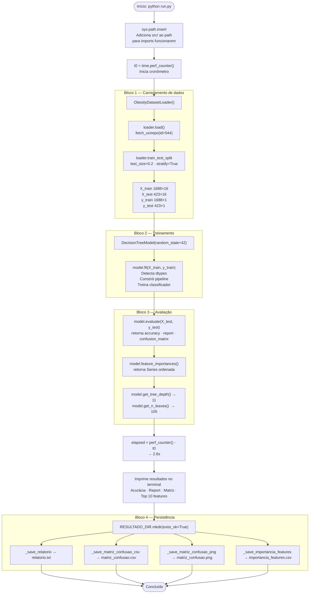
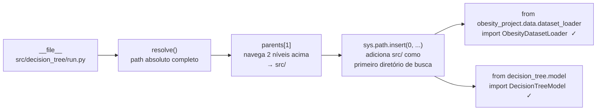

# 04 — Script de Execução e Artefatos Gerados

## Como executar

```bash
# A partir da raiz do projeto
python src/decision_tree/run.py
```

> O script manipula o `sys.path` internamente para encontrar os módulos em `src/`. Não é necessário configurar `PYTHONPATH` manualmente.

---

## Fluxo completo do `run.py`



---

## Resolução de imports — o `sys.path`

A linha mais importante do início do `run.py`:

```python
sys.path.insert(0, str(Path(__file__).resolve().parents[1]))
```

### O que ela faz



Sem essa linha, Python não encontraria os módulos `obesity_project` e `decision_tree` porque eles estão dentro de `src/`, que não está no path padrão.

---

## Funções de persistência — detalhes

### `_save_relatorio`

```python
def _save_relatorio(results, importances, train_size, test_size, elapsed, tree_depth, n_leaves):
```

Gera um arquivo texto estruturado com todos os metadados da execução:

```
==============================================================
  RESULTADOS — Decision Tree | UCI Obesity Levels (id=544)
==============================================================
Gerado em        : 2026-04-25 11:27:12
Tempo de execução: 2.6s
Amostras treino  : 1688
Amostras teste   : 423
Profundidade real: 11        ← exclusivo do Decision Tree
Número de folhas : 105       ← exclusivo do Decision Tree

Acurácia: 0.9125  (91.25%)

--- Relatório de Classificação ---
[classification_report completo por classe]

--- Importância das Features (completo) ---
[todas as 16 features com suas importâncias]
```

Os campos `Profundidade real` e `Número de folhas` são exclusivos deste módulo (não existem no Random Forest) e oferecem visibilidade sobre o tamanho real da árvore gerada.

---

### `_save_matriz_confusao_csv`

Converte o array numpy da matriz de confusão em um DataFrame pandas com os nomes das classes como índice e colunas, e salva como CSV:

```
real \ predito,Insufficient_Weight,Normal_Weight,...
Insufficient_Weight,47,7,0,0,0,0,0
Normal_Weight,1,48,0,0,0,9,0
...
```

A diagonal principal (valores corretos) e os valores fora dela (erros) ficam imediatamente legíveis.

---

### `_save_matriz_confusao_png`

Gera um heatmap com `seaborn` usando o colormap `Greens` (diferente do `Blues` do Random Forest — facilitando identificação visual ao comparar os dois módulos):

```python
sns.heatmap(cm, annot=True, fmt="d", cmap="Greens", linewidths=0.5, ax=ax)
ax.set_title("Matriz de Confusão — Decision Tree")
ax.set_ylabel("Classe Real")
ax.set_xlabel("Classe Predita")
plt.xticks(rotation=30, ha="right")
```

- `annot=True`: mostra os números dentro de cada célula
- `fmt="d"`: formato inteiro (sem casas decimais)
- `rotation=30`: rótulos do eixo X inclinados para não sobrepor
- `dpi=150`: resolução suficiente para apresentações e relatórios

---

### `_save_importancia_features`

Converte a `pd.Series` retornada por `feature_importances()` em DataFrame e salva:

```
feature,importancia
Weight,0.474104
Height,0.216299
Gender,0.157929
Age,0.042825
...
SCC,0.0
```

Útil para criar gráficos externos ou cruzar com os dados do Random Forest.

---

## Saída no terminal

```
Carregando dataset do UCI ML Repository...
Amostras de treino: 1688 | Amostras de teste:  423
Features: 16 | Classes: 7

Treinando Decision Tree...
Avaliando modelo no conjunto de teste...

==============================================================
  RESULTADOS — Decision Tree | UCI Obesity Levels (id=544)
==============================================================

Acurácia: 0.9125  (91.25%)
Profundidade da árvore: 11
Número de folhas      : 105

Relatório de Classificação:
                     precision    recall  f1-score   support

Insufficient_Weight       0.98      0.87      0.92        54
      Normal_Weight       0.77      0.83      0.80        58
     Obesity_Type_I       0.94      0.94      0.94        70
    Obesity_Type_II       0.97      0.97      0.97        60
   Obesity_Type_III       1.00      0.98      0.99        65
 Overweight_Level_I       0.82      0.84      0.83        58
Overweight_Level_II       0.92      0.93      0.92        58

           accuracy                           0.91       423

Importância das Features (top 10):
Weight    0.474104
Height    0.216299
Gender    0.157929
Age       0.042825
...

Tempo de execução: 2.6s

Salvando artefatos em resultado/...
  -> src\decision_tree\resultado\relatorio.txt
  -> src\decision_tree\resultado\matriz_confusao.csv
  -> src\decision_tree\resultado\matriz_confusao.png
  -> src\decision_tree\resultado\importancia_features.csv
Concluído.
```

---

## Artefatos gerados

```
src/decision_tree/resultado/
├── relatorio.txt               ← texto completo com todas as métricas
├── matriz_confusao.csv         ← tabela 7×7 com nomes das classes
├── matriz_confusao.png         ← heatmap verde (seaborn, dpi=150)
└── importancia_features.csv    ← 16 features ordenadas por importância
```

Todos os artefatos são sobrescritos a cada nova execução. Para preservar histórico, renomeie ou versione os arquivos manualmente antes de re-executar.

---

## Cronograma de tempo de execução

```mermaid
gantt
    title Execução total: 2.6s
    dateFormat X
    axisFormat %Ls

    section Dados
    Download / cache UCI       :0, 1500
    train_test_split           :1500, 1600

    section Modelo
    Construção do pipeline     :1600, 1700
    Treinamento da árvore      :1700, 2200

    section Avaliação
    Predict + métricas         :2200, 2400

    section Artefatos
    Salvar 4 arquivos + PNG    :2400, 2600
```



O tempo dominante é o **download do dataset** na primeira execução. Nas execuções seguintes (com cache), o treino fica em torno de 0.1s — demonstrando que a Árvore de Decisão é computacionalmente muito leve.

---

## `__init__.py` — interface pública do módulo

```python
from decision_tree.model import DecisionTreeModel
__all__ = ["DecisionTreeModel"]
```

Expõe apenas `DecisionTreeModel` como interface pública. Qualquer código externo que faça `from decision_tree import DecisionTreeModel` funciona sem precisar conhecer a estrutura interna de arquivos do módulo.
