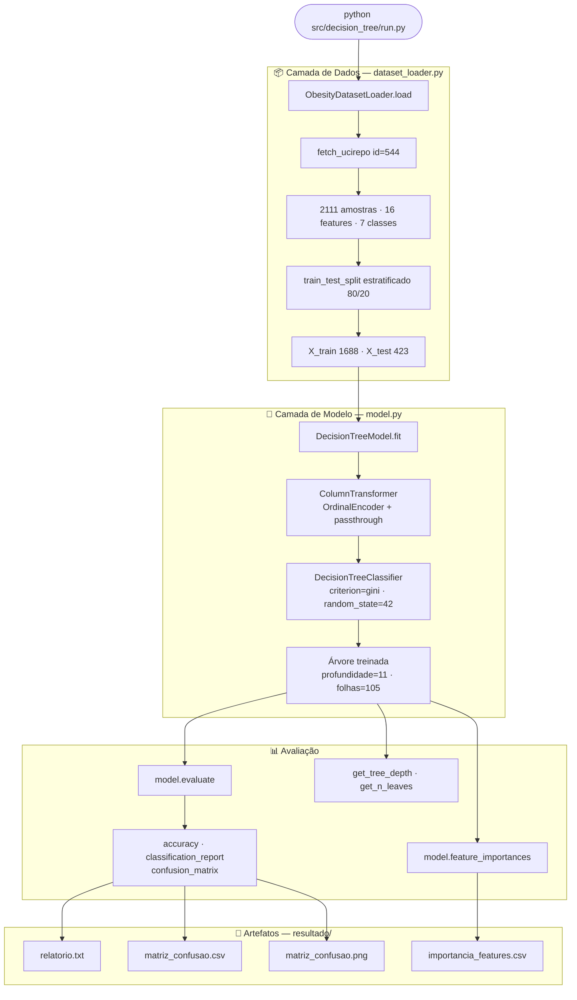

# Decision Tree — Documentação da Implementação

Documentação completa do módulo `src/decision_tree/` do projeto de classificação de obesidade.

---

## Navegação

| Arquivo | Conteúdo |
|---------|----------|
| [`01_dados.md`](01_dados.md) | Dataset UCI, carregamento, split estratificado |
| [`02_algoritmo.md`](02_algoritmo.md) | Como a Árvore de Decisão funciona internamente (Gini, divisões, crescimento) |
| [`03_pipeline.md`](03_pipeline.md) | Preprocessing, ColumnTransformer, Pipeline sklearn, classe `DecisionTreeModel` |
| [`04_execucao.md`](04_execucao.md) | Script `run.py`, fluxo de execução, artefatos gerados |

---

## Fluxo geral da aplicação



---

## Estrutura do módulo

```
src/decision_tree/
├── __init__.py               ← expõe DecisionTreeModel publicamente
├── model.py                  ← classe principal: fit, predict, evaluate, importances
├── run.py                    ← script executável de ponta a ponta
├── README.md                 ← guia rápido de uso
└── resultado/                ← gerado na primeira execução
    ├── relatorio.txt
    ├── matriz_confusao.csv
    ├── matriz_confusao.png
    └── importancia_features.csv
```

---

## Resultado obtido

| Métrica | Valor |
|---------|-------|
| Acurácia | **91.25%** |
| Profundidade da árvore | 11 |
| Número de folhas | 105 |
| Tempo de execução | 2.6s |
| Amostras treino / teste | 1688 / 423 |
